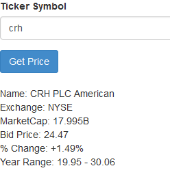

# Yahoo Finance API with AngularJS 

## App Specifics

The App uses the [Yahoo Query Language (YQL)](https://developer.yahoo.com/yql) with the Yahoo Finance REST API to retrieve financial data for a selected stock ticker symbol. 

## Running the App

- clone the repository
- bower install
- select 'index.html'
- Enter a valid stock ticker symbol

## Screen Shot

	

Michael Cullen 2014

